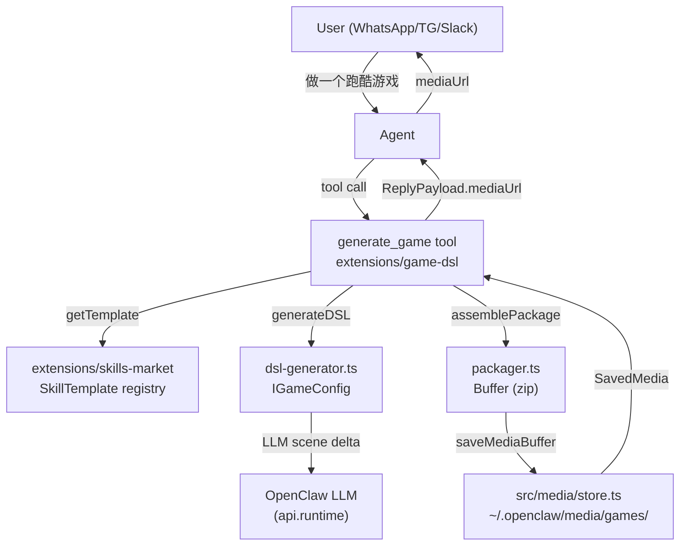
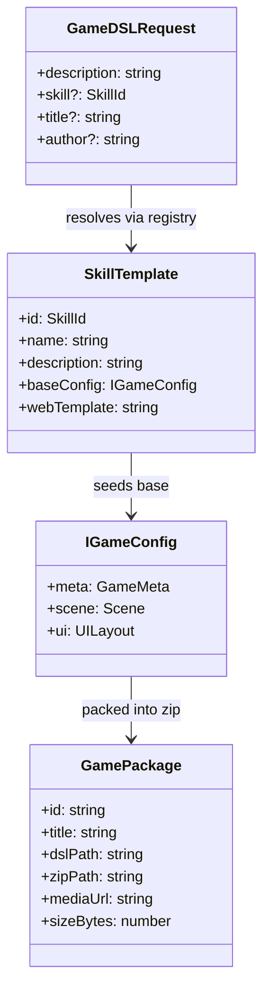

# Strategy: Lobster Game Studio

## 1. Situational Awareness

- **Context:** OpenClaw is a multi-channel AI messaging gateway. No game generation capability exists. Target: add DSL game generation as a plugin pair — zero core changes required.
- **Active Constitution:**
  - **Technical:**
    - New modules as `extensions/*` plugins. Source: CLAUDE.md > Project Structure.
    - CLI registration via `api.registerCli()`. Source: `src/plugins/types.ts:285`.
    - File I/O: use `writeJsonAtomic`. Source: CLAUDE.md Coding Style.
    - Tool Schema: `@sinclair/typebox`, forbid `Type.Union`. Use `Type.Unsafe<EnumLiteral>({type:"string",enum:[...]})` for string enums. Source: `extensions/lobster/src/lobster-tool.ts:218`.
    - File ceiling: < 700 LOC. Source: CLAUDE.md Coding Style.
    - Plugin `dependencies` must be exact (no `^`/`~`) for patched deps. Source: CLAUDE.md.
  - **Style:** Strict adherence to `skills/style-hemingway.md` (Iceberg Principle). Terse interfaces. No meta-narrative. Type definitions precede logic. Comments explain _why_, never _what_.
  - **Security:** Zero Trust. Validate all tool inputs. `ownerOnly: true` on write-capable tools. No path traversal. Zip size bounded (< 20MB).

---

## 2. Assessment

<Assessment>

**Complexity:** Level 3 (new data model + multi-step pipeline + binary artifact generation + multi-file plugin)

**Critical Risks:**

1. Zip size may exceed `saveMediaBuffer` 5MB default — must override `maxBytes` parameter (signature supports it: `saveMediaBuffer(buffer, contentType, subdir, maxBytes)`).
2. `Type.Union` ban — all enum params must use `Type.Unsafe` pattern from lobster reference.
3. `mediaUrl` in `ReplyPayload` is a plain string (not typed array) — multi-file output must use `mediaUrls?: string[]` field (both exist in `src/auto-reply/types.ts:74`).
4. Plugin `runtime` deps: `@sinclair/typebox` exact version `0.34.48` (matches lobster). `jszip` or `archiver` for zip — add to plugin `dependencies`.
5. Skills Market is content data, not code — store as JSON assets in `extensions/skills-market/templates/`, not TS logic.

</Assessment>

---

## 3. Abstract Specification

### 3.1 Data Model

```typescript
// --- MaxelLabs Protocol (given, read-only) ---
type Vector3 = { x: number; y: number; z: number };
type TransformComponent = {
  type: "transform";
  position: Vector3;
  rotation: Vector3;
  scale: Vector3;
};
type VisualComponent = { type: "visual"; mesh: string; material: string };
type ScriptComponent = { type: "script"; script: string; props?: Record<string, unknown> };
type Component = TransformComponent | VisualComponent | ScriptComponent;
type Entity = { id: string; name?: string; components: Component[] };
type UILayout = { elements: Array<{ id: string; kind: string; props: Record<string, unknown> }> };
type Scene = { entities: Entity[]; environment?: { skybox?: string; ambientColor?: string } };
type IGameConfig = {
  meta: { title: string; author: string; engine: "galacean" | "godot" | "unity" };
  scene: Scene;
  ui: UILayout;
};

// --- New Types: extensions/game-dsl/src/types.ts ---
type SkillId = "platformer" | "puzzle" | "rpg" | "shooter" | "idle";

type SkillTemplate = {
  id: SkillId;
  name: string;
  description: string;
  // Seed IGameConfig; merged with LLM-generated scene delta
  baseConfig: IGameConfig;
  // Galacean web scaffold template path (relative to package)
  webTemplate: string;
};

type GameDSLRequest = {
  description: string; // raw user message
  skill: SkillId; // resolved by agent or explicit
  title?: string; // override; fallback: derived from description
  author?: string; // fallback: "Anonymous"
};

type GamePackage = {
  // Stable artifact identifier
  id: string;
  title: string;
  dslPath: string; // absolute path to game-config.json on disk
  zipPath: string; // absolute path to game-xxx.zip on disk
  mediaUrl: string; // served URL: http://localhost:18789/media/games/<id>.zip
  sizeBytes: number;
};
```

**Type Relationships:**

```
GameDSLRequest
  |-- resolves --> SkillTemplate (from skills-market registry)
  |-- feeds --> IGameConfig (LLM-augmented)
  |-- produces --> GamePackage (via packager)
                      |-- stored via saveMediaBuffer()
                      |-- returned as ReplyPayload.mediaUrl
```

---

### 3.2 Core Algorithm

<LogicSpec>

#### Step 1: Skill Resolution

```
FUNCTION resolveSkill(description: string, explicitSkill?: SkillId) -> SkillId
  IF explicitSkill IS SET THEN RETURN explicitSkill
  keywords = {
    "platformer": ["跑酷", "jump", "run", "platform"],
    "puzzle":     ["解谜", "puzzle", "match"],
    "rpg":        ["角色", "rpg", "quest", "story"],
    "shooter":    ["射击", "shoot", "bullet"],
    "idle":       ["放置", "idle", "clicker"]
  }
  FOR each (skillId, terms) IN keywords:
    IF any term IN description.toLowerCase() THEN RETURN skillId
  RETURN "platformer"  // safe default
```

#### Step 2: DSL Generation

```
FUNCTION generateDSL(req: GameDSLRequest, template: SkillTemplate) -> IGameConfig
  base = deepClone(template.baseConfig)
  base.meta.title  = req.title  ?? deriveTitle(req.description)
  base.meta.author = req.author ?? "Anonymous"
  // LLM call: inject description, ask for scene delta (entities array only)
  delta = await LLM.call(PROMPT_SCENE_DELTA, { description: req.description, base })
  // Merge: delta entities appended, not replaced (preserve template anchors)
  base.scene.entities = [...base.scene.entities, ...delta.entities]
  RETURN base
```

#### Step 3: Package Assembly

```
FUNCTION assemblePackage(config: IGameConfig, template: SkillTemplate, id: string) -> Buffer
  zip = new JSZip()
  zip.file("game-config.json", JSON.stringify(config, null, 2))
  // Galacean web scaffold: copy from template.webTemplate directory
  webFiles = readDir(template.webTemplate)
  FOR each file IN webFiles:
    zip.file("web/" + file.relativePath, file.buffer)
  // Inject config into web scaffold index.html (token replace: __GAME_CONFIG__)
  indexHtml = zip.file("web/index.html").content
  zip.file("web/index.html", indexHtml.replace("__GAME_CONFIG__", JSON.stringify(config)))
  // Export docs
  zip.file("docs/godot-import.md",  renderGodotDoc(config))
  zip.file("docs/unity-import.md",  renderUnityDoc(config))
  RETURN zip.generateAsync({ type: "nodebuffer", compression: "DEFLATE" })
```

#### Step 4: Store and Reply

```
FUNCTION storeAndReply(zipBuffer: Buffer, id: string, title: string) -> ReplyPayload
  ENFORCE zipBuffer.byteLength < 20_971_520  // 20MB hard limit
  saved = await saveMediaBuffer(
    zipBuffer,
    "application/zip",
    "games",             // subdir
    20_971_520,          // maxBytes override
    `game-${id}.zip`     // originalFilename
  )
  RETURN {
    text:     `游戏《${title}》已生成。`,
    mediaUrl: `http://localhost:18789/media/games/${saved.id}`
  }
```

#### Full Pipeline (Agent Tool Entry Point)

```
TOOL generate_game(params: { description, skill?, title?, author? }) -> AgentToolResult
  req      = validate(params) as GameDSLRequest          // throws ToolInputError on bad input
  template = SkillsMarket.get(resolveSkill(req.description, req.skill))
  config   = await generateDSL(req, template)
  id       = crypto.randomUUID()
  zipBuf   = await assemblePackage(config, template, id)
  reply    = await storeAndReply(zipBuf, id, config.meta.title)
  RETURN jsonResult(reply)
```

</LogicSpec>

---

## 4. Execution Plan

<ExecutionPlan>

### Block A: Skills Market Plugin

**Purpose:** Provide `SkillTemplate` registry. Static JSON data + a thin TS loader.

1. **CREATE** `extensions/skills-market/package.json`
   - `name`: `@openclaw/skills-market`
   - `dependencies`: `@sinclair/typebox: "0.34.48"` (exact)
   - `openclaw.extensions`: `["./index.ts"]`

2. **CREATE** `extensions/skills-market/src/types.ts`
   - Export: `SkillId`, `SkillTemplate`
   - No logic. Types only.

3. **CREATE** `extensions/skills-market/templates/platformer.json`
   - Minimal valid `IGameConfig` seed: 3 entities (player, ground, camera), basic UI.

4. **CREATE** `extensions/skills-market/templates/puzzle.json`, `rpg.json`, `shooter.json`, `idle.json`
   - Same shape, genre-appropriate entity seeds.

5. **CREATE** `extensions/skills-market/src/registry.ts`
   - Exports: `getTemplate(id: SkillId): SkillTemplate`
   - Loads from `../templates/*.json` at module init.
   - Throws if `id` not found.

6. **CREATE** `extensions/skills-market/index.ts`
   - Plugin entry: `registerTool` exposing `list_skill_templates` tool (read-only, no `ownerOnly`).
   - Tool schema: `Type.Object({ filter: Type.Optional(Type.String()) })`
   - Returns: array of `{ id, name, description }` (no `baseConfig` in response — too large).
   - Constraint: `< 80 LOC`.

---

### Block B: Game DSL Plugin

**Purpose:** Core generation engine. Depends on skills-market registry.

1. **CREATE** `extensions/game-dsl/package.json`
   - `name`: `@openclaw/game-dsl`
   - `dependencies`: `@sinclair/typebox: "0.34.48"`, `jszip: "3.10.1"` (exact)
   - `openclaw.extensions`: `["./index.ts"]`

2. **CREATE** `extensions/game-dsl/src/types.ts`
   - Export: `GameDSLRequest`, `GamePackage`
   - Import `IGameConfig` shape inline (do not import from maxellabs — define locally to avoid external dep).

3. **CREATE** `extensions/game-dsl/src/skill-resolver.ts`
   - Exports: `resolveSkill(description: string, explicit?: SkillId): SkillId`
   - Implements keyword map from LogicSpec Step 1.
   - Constraint: pure function, no I/O.

4. **CREATE** `extensions/game-dsl/src/dsl-generator.ts`
   - Exports: `generateDSL(req: GameDSLRequest, template: SkillTemplate, llmCall: LLMCallFn): Promise<IGameConfig>`
   - `LLMCallFn` is injected (no direct LLM import) — caller passes `api.runtime` capability.
   - Applies LogicSpec Step 2 merge logic.
   - Constraint: `< 150 LOC`.

5. **CREATE** `extensions/game-dsl/src/packager.ts`
   - Exports: `assemblePackage(config: IGameConfig, template: SkillTemplate, id: string): Promise<Buffer>`
   - Uses `jszip`. Implements LogicSpec Step 3.
   - `renderGodotDoc` and `renderUnityDoc` are private helpers in this file.
   - Constraint: `< 200 LOC`.

6. **CREATE** `extensions/game-dsl/src/web-scaffold/`
   - Static Galacean web template files: `index.html`, `galacean-runtime.js` (stub/reference link).
   - `index.html` contains token `__GAME_CONFIG__` for injection.
   - These are bundled assets, not TS.

7. **CREATE** `extensions/game-dsl/src/generate-tool.ts`
   - Exports: `createGenerateTool(api: OpenClawPluginApi): AnyAgentTool`
   - Tool name: `generate_game`
   - Schema (TypeBox, no `Type.Union`):
     ```typescript
     Type.Object({
       description: Type.String(),
       skill: Type.Optional(
         Type.Unsafe<SkillId>({
           type: "string",
           enum: ["platformer", "puzzle", "rpg", "shooter", "idle"],
         }),
       ),
       title: Type.Optional(Type.String()),
       author: Type.Optional(Type.String()),
     });
     ```
   - `ownerOnly: true` — zip generation is write-capable.
   - Calls: `resolveSkill` -> `getTemplate` -> `generateDSL` -> `assemblePackage` -> `saveMediaBuffer` -> returns `jsonResult(ReplyPayload)`.
   - Constraint: orchestration only, `< 100 LOC`. No inline logic.

8. **CREATE** `extensions/game-dsl/index.ts`
   - Mirrors lobster pattern exactly:
     ```typescript
     export default function register(api: OpenClawPluginApi) {
       api.registerTool((ctx) => (ctx.sandboxed ? null : createGenerateTool(api)), {
         optional: true,
       });
     }
     ```

---

### Block C: Auto-Reply Delivery (No Core Changes)

**Decision:** `ReplyPayload.mediaUrl` already supports single-file delivery. `mediaUrls` supports multi-file. No modification to `src/auto-reply/` is needed.

The tool returns `jsonResult({ text, mediaUrl })`. The existing agent pipeline reads `ReplyPayload` fields and routes media delivery.

- **Verify** (read-only): confirm `src/auto-reply/reply/` consumes `mediaUrl` for channels (WhatsApp, TG, Slack). If any channel ignores `mediaUrl`, that is a pre-existing gap — out of scope.

---

### Block D: Tests

1. **CREATE** `extensions/game-dsl/src/skill-resolver.test.ts`
   - Vitest. Tests: Chinese keyword match, English keyword match, default fallback.

2. **CREATE** `extensions/game-dsl/src/packager.test.ts`
   - Vitest. Tests: zip contains `game-config.json`, `web/index.html` with injected config, `docs/godot-import.md`.

3. **CREATE** `extensions/skills-market/src/registry.test.ts`
   - Vitest. Tests: all 5 skill IDs resolve without throw.

</ExecutionPlan>

---

## 5. Key Rules

### Forbidden Patterns (Constitutional Check)

| Forbidden                                          | Reason                                 | Source                             |
| -------------------------------------------------- | -------------------------------------- | ---------------------------------- |
| `Type.Union(...)` in tool schema                   | Provider validator rejects `anyOf`     | CLAUDE.md tool schema guardrail    |
| `workspace:*` in `dependencies`                    | npm install breaks at runtime          | CLAUDE.md plugin structure         |
| `applyPrototypeMixins` or `.prototype` mutation    | TypeScript loses type safety           | CLAUDE.md coding style             |
| `@ts-nocheck`                                      | Masks root causes                      | CLAUDE.md coding style             |
| `await import("x")` mixed with `import x from "x"` | Ineffective dynamic import warning     | CLAUDE.md dynamic import guardrail |
| Files > 700 LOC                                    | Clarity ceiling                        | CLAUDE.md                          |
| `saveMediaBuffer` without `maxBytes` override      | Default 5MB will reject realistic zips | `src/media/store.ts:346`           |

### Dependency Declaration Rules

- `@sinclair/typebox: "0.34.48"` — exact, matches lobster reference (`extensions/lobster/package.json`).
- `jszip: "3.10.1"` — exact. Add only to `extensions/game-dsl/package.json` `dependencies`.
- `openclaw` (plugin-sdk) — in `devDependencies` or `peerDependencies` only. Never `dependencies`.
- Do not add any game-dsl dep to root `package.json`.

### Test Strategy

- Unit tests for pure functions: `skill-resolver`, `registry`.
- Integration test for `packager`: uses real `jszip`, validates zip entries, no I/O mocking needed.
- No live LLM tests in CI. `dsl-generator` is tested with a mock `llmCall` stub.
- Coverage target: 70% lines/branches (repo baseline). Source: CLAUDE.md Testing Guidelines.

### Style Mandate

All code and comments written by the Worker must adhere to `skills/style-hemingway.md`:

- No prose walls in comments. One-line max.
- Interface exported before implementation.
- No "Introduction" or "Summary" JSDoc blocks.
- Function names are verbs. Type names are nouns.

---

## 6. Dependency & Data Flow Diagram




